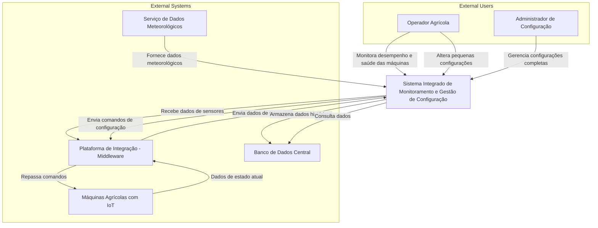

# Sistema Integrado de Monitoramento e Gestão de Configuração para Máquinas Agrícolas

# Atores e Sistemas Externos

## Atores:
- **Operador Agrícola:** Usuário responsável por monitorar em tempo real a saúde e o desempenho das máquinas agrícolas, além de realizar ajustes operacionais simples.
- **Administrador de Configuração:** Usuário que gerencia as configurações avançadas das máquinas e do sistema, garantindo o funcionamento ideal de toda a frota.

## Sistemas Externos:
- **Máquinas Agrícolas com IoT:** Equipamentos agrícolas equipados com sensores IoT capazes de enviar dados de telemetria e receber comandos de configuração.
- **Plataforma de Integração (Middleware):** Sistema que faz a mediação entre os dispositivos IoT (máquinas agrícolas) e o sistema central, traduzindo dados e comandos.
- **Serviço de Dados Meteorológicos:** Serviço externo que fornece informações sobre o clima para suporte a decisões de manutenção e operação.
- **Banco de Dados Central:** Sistema responsável pelo armazenamento persistente dos dados operacionais, históricos e de configuração.

 

# Descrição do Sistema

## Escopo do Sistema
O Sistema Integrado (Serviço Interno) tem as seguintes responsabilidades:

- Monitorar em tempo real o desempenho e a saúde de cada máquina.
- Permitir a alteração de configurações, tanto básicas (Operador) quanto avançadas (Administrador).
- Integrar informações meteorológicas externas no processo decisório.
- Persistir dados operacionais e históricos no Banco de Dados Central.
- Oferecer uma interface de acesso para computadores e dispositivos móveis.

O sistema **NÃO** será responsável por:

- Capturar diretamente os dados dos sensores IoT (função da Plataforma de Integração).
- Gerar ou manipular dados meteorológicos (função do Serviço de Dados Meteorológicos).
- Gerenciar o armazenamento físico dos dados (função do Banco de Dados Central).