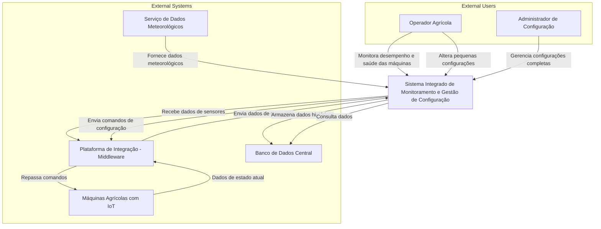

# M10-S01-C4Model

```mermaid
flowchart TB
    subgraph External Users
        Operator[Operador Agrícola]
        Admin[Administrador de Configuração]
    end

    subgraph External Systems
        WeatherService[Serviço de Dados Meteorológicos]
        IoTPlatform[Plataforma de Integração - Middleware]
        Machines[Máquinas Agrícolas com IoT]
        Database[Banco de Dados Central]
    end

    System[Sistema Integrado de Monitoramento e Gestão de Configuração]

    %% Fluxos
    Operator -->|Monitora desempenho e saúde das máquinas| System
    Operator -->|Altera pequenas configurações| System
    Admin -->|Gerencia configurações completas| System

    System -->|Recebe dados de sensores| IoTPlatform
    IoTPlatform -->|Envia dados de telemetria| System

    System -->|Envia comandos de configuração| IoTPlatform
    IoTPlatform -->|Repassa comandos| Machines

    Machines -->|Dados de estado atual| IoTPlatform

    WeatherService -->|Fornece dados meteorológicos| System

    System -->|Armazena dados históricos| Database
    System -->|Consulta dados| Database

```